<p align="center">
  
</p>

<h1 align="center">Ensignbase</h1>

<p align="center">
  <strong>Gelişmiş Supabase Yönetim Paneli ve Gözlem Aracı</strong><br>
  <em>Powered by Ensignsoft</em>
</p>

<p align="center">
  Supabase projelerinizi tek bir masaüstü penceresinden yönetin,<br>
  canlı telemetriyi izleyin ve anahtarlarınızı cihazınızda şifreli tutun.
</p>

<p align="center">
  
  
  
  
  
</p>

<p align="center">
  <a href="#-hakkında">Hakkında</a> ·
  <a href="#-ekran-görüntüleri">Ekran Görüntüleri</a> ·
  <a href="#-öne-çıkan-özellikler">Özellikler</a> ·
  <a href="#-nasıl-çalışır">Nasıl Çalışır</a> ·
  <a href="#-kurulum-ve-indirme">Kurulum</a> ·
  <a href="#️-güvenlik-ve-gizlilik-privacy">Güvenlik</a> ·
  <a href="#-lisans-ve-telif-hakkı">Lisans</a>
</p>

---

## 🚀 Hakkında

**Ensignbase**, Supabase projelerinizi yönetmek, veritabanı performansını izlemek ve metrikleri tek bir ekrandan gözlemlemek için Ensignsoft tarafından geliştirilmiş modern, hızlı ve yüksek performanslı bir masaüstü uygulamasıdır.

Rust tabanlı **Tauri** mimarisi sayesinde sistem kaynaklarını minimum düzeyde tüketirken maksimum verim sağlar. Tarayıcıya veya üçüncü taraf bir panele bağlı kalmadan, kendi cihazınızda çalışan yerel bir kontrol merkezidir.

| Ne işe yarar | Neden Ensignbase |
| --- | --- |
| Tüm organizasyon projelerini tek bakışta görmek | Kart tabanlı **All Projects** görünümü, CPU / RAM / ağ özeti |
| Canlı sağlık takibi | Yüksek frekanslı CPU, RAM ve Network I/O grafikleri |
| Anahtarları güvende tutmak | PAT hiçbir sunucuya gitmez; diskte **AES** ile şifrelenir |
| Hesabı yönetmek | Profil, güvenlik, tema, entegrasyon, faturalama ve denetim kayıtları |

---

## 🖼 Ekran Görüntüleri

Aşağıdaki görseller, uygulamanın ilk açılişından bildirim paneline kadar gerçek akışı sırasıyla gösterir.

### 01 · İlk giriş ve yerel kilit

Supabase Personal Access Token’ınızı girin ve yalnızca sizin bildiğiniz bir **yerel ana şifre** belirleyin. Token bu şifreyle AES olarak şifrelenir; düz metin olarak saklanmaz.

<p align="center">
  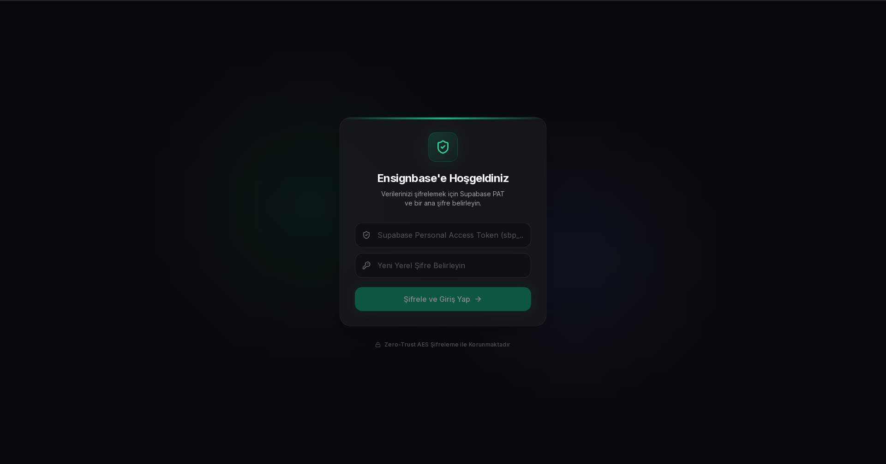
</p>

### 02 · Güvenli bağlantı

Token doğrulanırken arayüz bağlantı durumunu gösterir. Alt kısımda **Zero-Trust AES Şifreleme ile Korunmaktadır** uyarısı her zaman görünür.

<p align="center">
  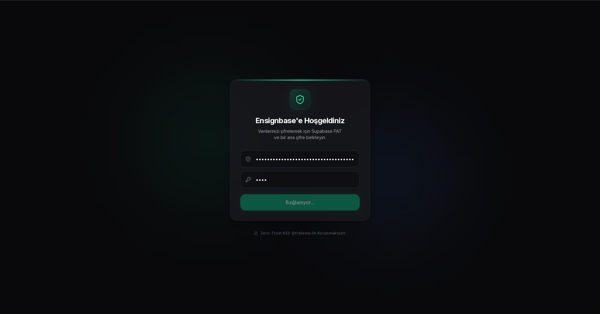
</p>

### 03 · Tüm projeler

Girişten sonra tüm deployment’lar tek grid’de listelenir. Her kartta bölge, proje referansı ve anlık **CPU / RAM / NET** özeti yer alır.

<p align="center">
  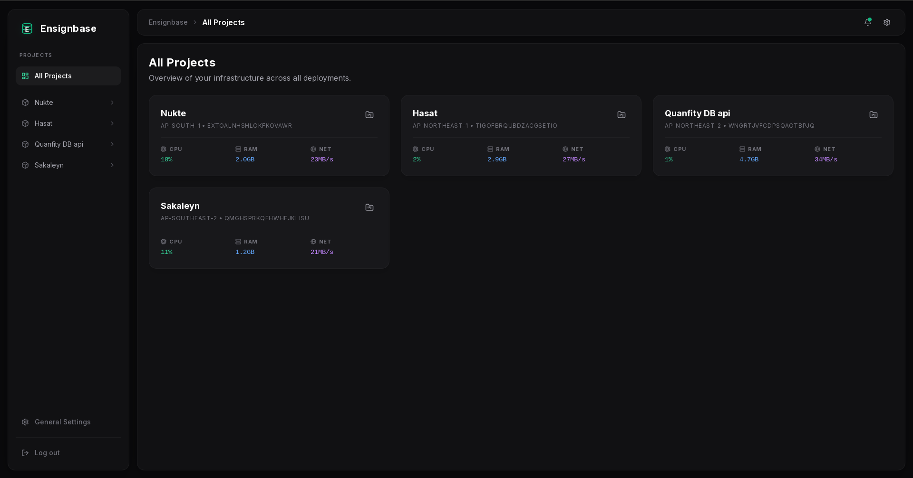
</p>

### 04 · Proje genel bakış

Bir projeye girdiğinizde sunucu kullanımı, veritabanı boyutu, ağ aktivitesi, son API logları ve hızlı işlemler (kullanıcı / ortam / explorer) aynı ekranda toplanır.

<p align="center">
  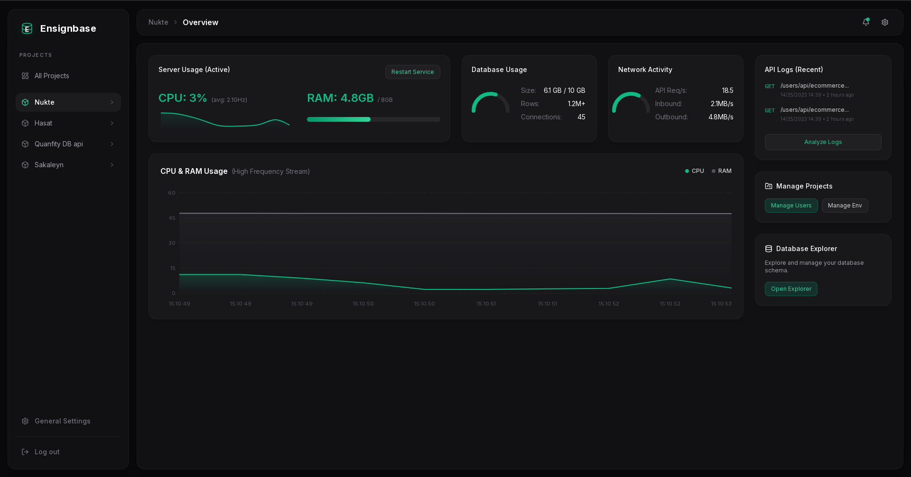
</p>

### 05 · Canlı telemetri ve tanı

**Live Usage** görünümü CPU, RAM ve Network I/O’yu yüksek frekanslı akış olarak çizer. Yanında transaction logları (INFO / WARN / SUCCESS) akar.

<p align="center">
  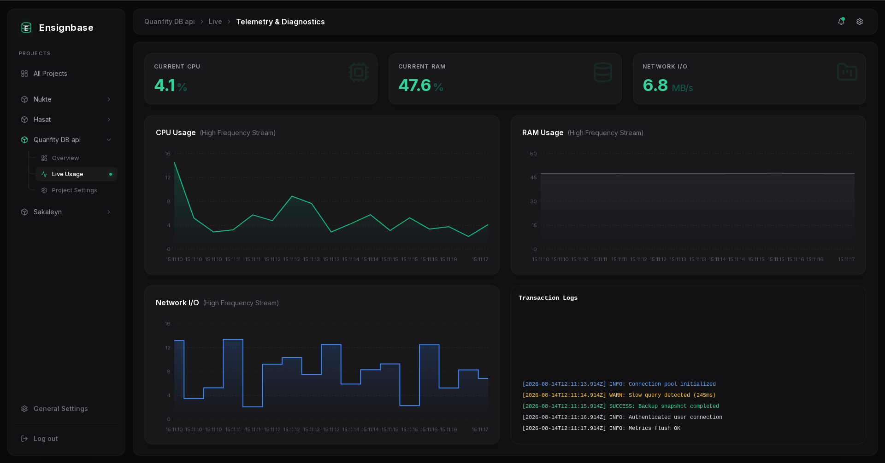
</p>

### 06 · Hesap ve profil

**Account & Preferences** altında ad, soyad, e-posta ve avatar yönetilir.

<p align="center">
  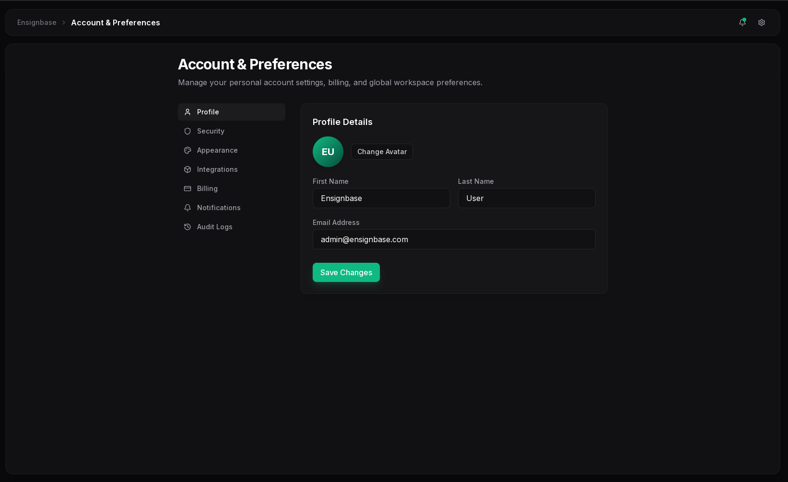
</p>

### 07 · Güvenlik ve 2FA

Yerel kilit şifresini güncelleyin ve hesap için **Authenticator App** ile iki faktörlü doğrulamayı etkinleştirin.

<p align="center">
  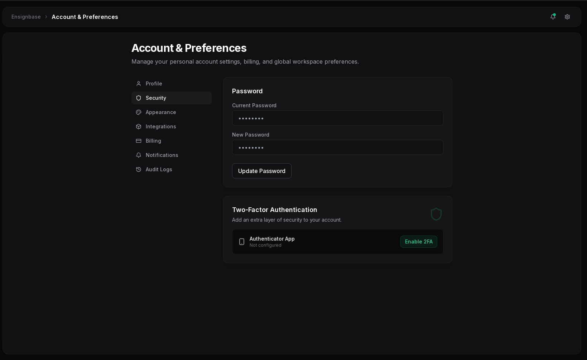
</p>

### 08 · Görünüm ve tema

Koyu (varsayılan), açık veya sistem temasını tek tıkla seçin.

<p align="center">
  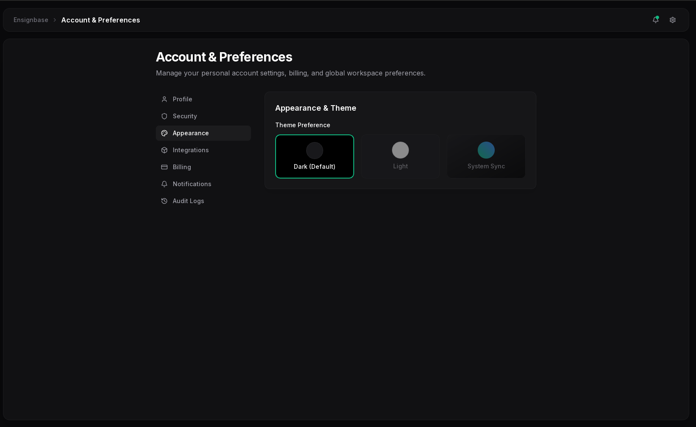
</p>

### 09 · Entegrasyonlar

GitHub üzerinden depolardan dağıtım ve Slack kanallarına uyarı / deployment durumu bağlanabilir.

<p align="center">
  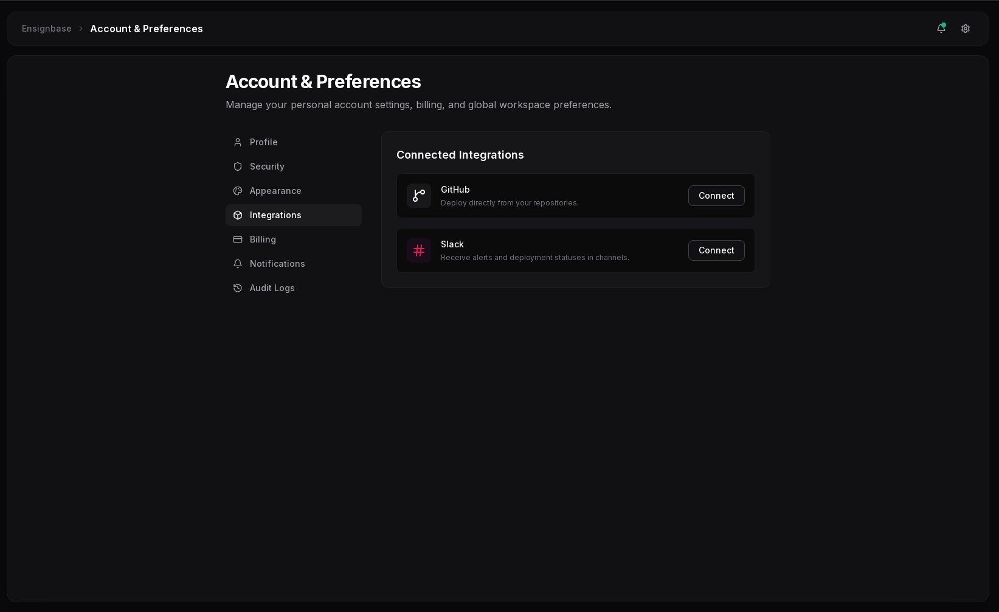
</p>

### 10 · Faturalama

Mevcut plan, abonelik yönetimi ve kayıtlı ödeme yöntemleri bu ekrandan takip edilir.

<p align="center">
  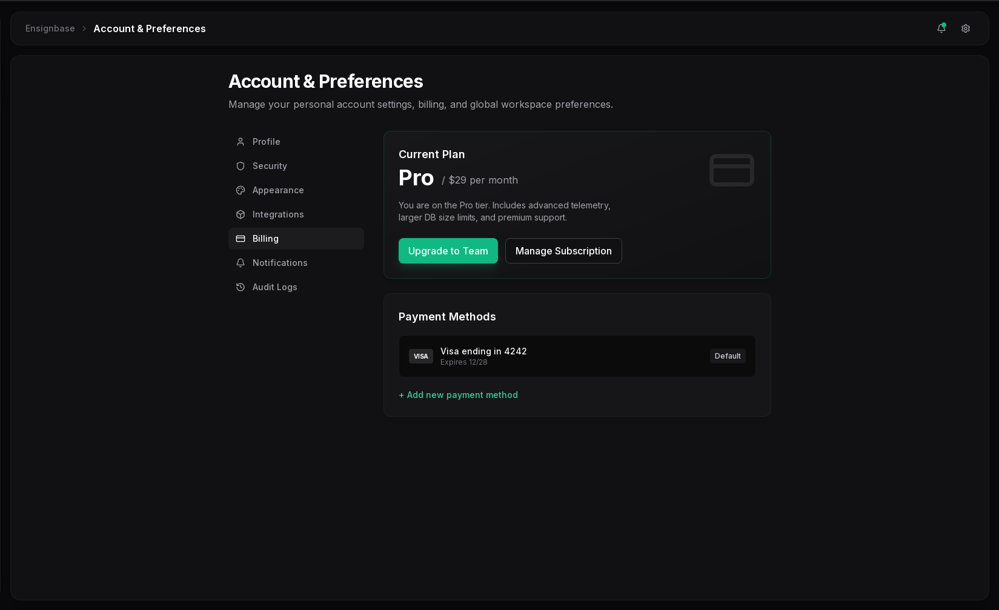
</p>

### 11 · Bildirim tercihleri

Proje uyarıları, fatura güncellemeleri ve pazarlama e-postaları ayrı ayrı açılıp kapatılır.

<p align="center">
  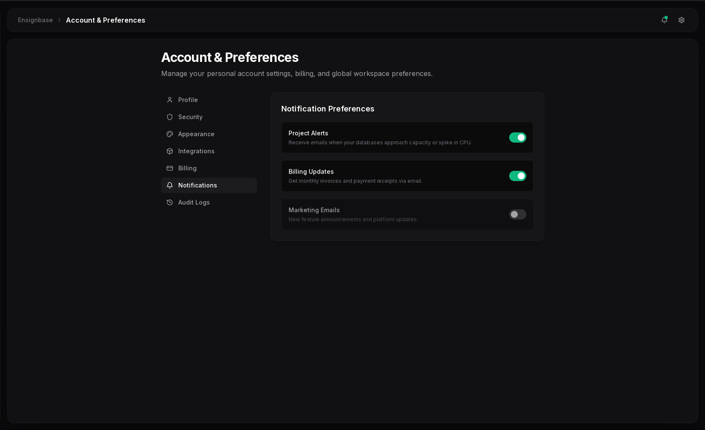
</p>

### 12 · Denetim kayıtları

Başarılı giriş, API anahtarı rotasyonu ve veritabanı yeniden başlatma gibi güvenlik olayları kronolojik olarak listelenir.

<p align="center">
  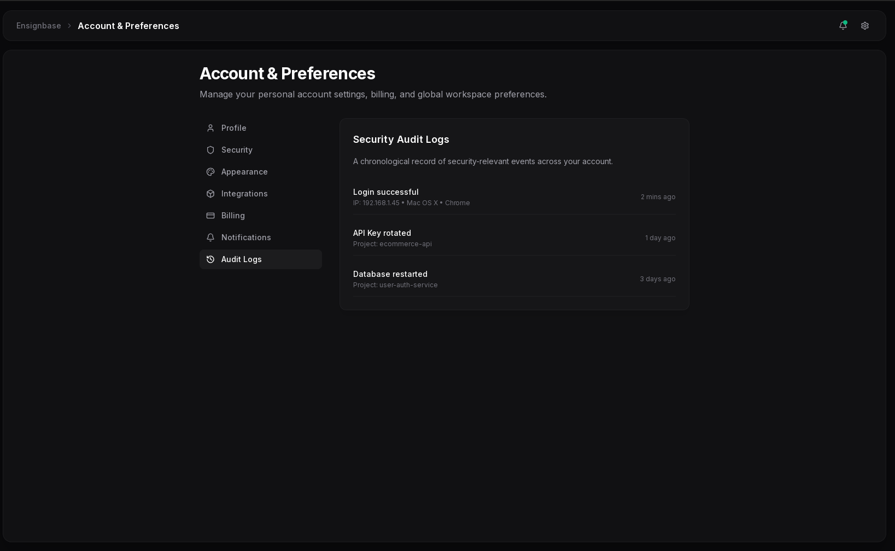
</p>

### 13 · Anlık bildirimler

Sağ üstteki zil, yüksek CPU, başarılı deployment ve hoş geldin mesajları gibi olayları anında gösterir.

<p align="center">
  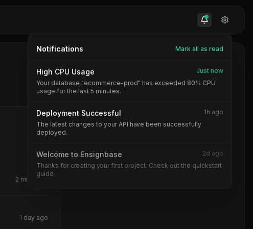
</p>

---

## ✨ Öne Çıkan Özellikler

- **🔒 Zero-Trust AES Şifreleme**  
  Supabase API anahtarlarınız asla Ensignsoft sunucularına gönderilmez ve cihazda düz metin olarak tutulmaz. Belirlediğiniz Ana Şifre (Master Password) ile diskte AES formatında şifrelenir.

- **🗂 Tek bakışta tüm projeler**  
  Organizasyondaki her proje; bölge, referans ve canlı CPU / RAM / ağ özetiyle kart olarak listelenir.

- **📊 Canlı telemetri ve gözlem**  
  RAM, CPU ve ağ tüketimini yüksek frekanslı grafikler ve transaction loglarıyla izleyin.

- **🧭 Proje kontrol merkezi**  
  Sunucu kullanımı, veritabanı boyutu / satır / bağlantı sayısı, son API logları, kullanıcı ve ortam yönetimi, Database Explorer kısayolları.

- **👤 Hesap ve tercihler**  
  Profil, güvenlik (şifre + 2FA), görünüm, GitHub / Slack entegrasyonları, faturalama, bildirim tercihleri ve denetim kayıtları.

- **🔔 Anlık uyarılar**  
  Yüksek CPU, başarılı dağıtım ve sistem mesajları bildirim çekmecesinde toplanır.

- **🎨 Glassmorphism arayüz**  
  Modern, akıcı ve göz yormayan koyu / açık / sistem teması.

- **⚡ Yüksek performans**  
  Rust çekirdeği ve Tauri sayesinde düşük bellek, hızlı açılış, bekleme ekranı olmadan yüklenen veriler.

---

## 🧭 Nasıl Çalışır

```text
1. Ensignbase’i açın
2. Supabase Personal Access Token (PAT) girin
3. Yalnızca sizin bildiğiniz bir yerel ana şifre belirleyin
4. Token AES ile şifrelenerek cihaza yazılır
5. Projeler Supabase Management API üzerinden çekilir
6. Overview ve Live Usage ekranlarından telemetri izlenir
7. Sonraki açılışlarda yalnızca yerel şifre ile kilit açılır
```

İlk kurulumdan sonra token tekrar girmeniz gerekmez. Cihaz her açıldığında kilit, yerel şifrenizle çözülür.

**Personal Access Token almak için:** [Supabase Dashboard → Account → Access Tokens](https://supabase.com/dashboard/account/tokens)

---

## 📦 Kurulum ve İndirme

Ensignbase açık kaynaklı değildir; yalnızca derlenmiş paketler aracılığıyla dağıtılır. İşletim sisteminize uygun paketi indirip saniyeler içinde kurabilirsiniz.

### 🐧 Linux (Fedora, RHEL, CentOS)

```bash
sudo dnf install ./ensignbase-0.1.0-1.x86_64.rpm
```

### 🐧 Linux (Ubuntu, Debian, Mint)

```bash
sudo dpkg -i ./ensignbase_0.1.0_amd64.deb
sudo apt-get install -f
```

### 🐧 AppImage (taşınabilir — kurulum gerektirmez)

```bash
chmod +x ./ensignbase_0.1.0_amd64.AppImage
./ensignbase_0.1.0_amd64.AppImage
```

### 🪟 Windows ve 🍎 macOS

Windows (`.msi` / `.exe`) ve macOS (`.dmg`) paketleri release sayfasından indirilebilir. İndirdikten sonra standart yükleyiciyi çalıştırmanız yeterlidir.

---

## 💻 Sistem Gereksinimleri

| | Minimum |
| --- | --- |
| İşletim sistemi | Linux (x86_64), Windows 10+, macOS 11+ |
| RAM | 2 GB (4 GB önerilir) |
| Disk | ~80 MB kurulum alanı |
| Ağ | Supabase Management API erişimi |
| Ekran | 900 × 650 (önerilen 1100 × 750 ve üzeri) |

---

## 🛡 Güvenlik ve Gizlilik (Privacy)

Ensignbase **Zero-Trust** mimarisiyle çalışır.

- Girdiğiniz **Supabase Personal Access Token (PAT)** yalnızca yerel makinenizde kalır.
- Token, sizin belirlediğiniz ana şifre ile **AES** olarak şifrelenir (`ENC:…` önekiyle diskte tutulur).
- Ensignsoft bu anahtarları toplamaz, iletmez veya saklamaz.
- Cihaz her açıldığında anahtarı çözmek için yerel kilit şifreniz gerekir.
- Denetim kayıtları hesap üzerindeki güvenlik olaylarını (giriş, anahtar rotasyonu, servis yeniden başlatma) kronolojik tutar.

Detaylı hukuki çerçeve için [LICENSE](../LICENSE) dosyasındaki EULA’ya bakınız.

---

## 🧱 Teknoloji Yığını

| Katman | Teknoloji |
| --- | --- |
| Masaüstü kabuğu | [Tauri 2](https://tauri.app) |
| Arayüz | React 19 · TypeScript · Tailwind CSS |
| Grafikler | Recharts |
| Yerel şifreleme | AES (CryptoJS) |
| Yerel çekirdek | Rust · Tokio · reqwest · sysinfo |

Uygulama kimliği: `com.ensignbase.app` · Sürüm: **0.1.0**

---

## 🗺 Uygulama Haritası

```text
Ensignbase
├── Giriş / Kilit açma
├── All Projects
├── Proje
│   ├── Overview          sunucu, DB, ağ, API logları
│   ├── Live Usage        canlı CPU / RAM / Network I/O
│   └── Project Settings  genel, veritabanı, API, auth
└── Account & Preferences
    ├── Profile
    ├── Security
    ├── Appearance
    ├── Integrations
    ├── Billing
    ├── Notifications
    └── Audit Logs
```

---

## 📝 Lisans ve Telif Hakkı

Bu yazılım kapalı kaynaklı ve tescilli bir üründür.

Copyright © 2026 **Ensignsoft**. Tüm hakları saklıdır.

İzin alınmadan çoğaltılamaz, dağıtılamaz veya tersine mühendislik yapılamaz. Detaylı bilgi için [LICENSE](../LICENSE) dosyasına bakınız.

---

<p align="center">
  <sub>Geliştirici: <strong>Ensignsoft</strong> · Ensignbase v0.1.0</sub>
</p>
